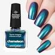
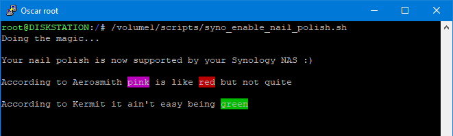

#  Syno enable nail polish

Add your 3rd-party Nail Polish to Synology's supported nail polish database so you can paint your orange drive LEDs green :o)
It's a joke... 

Inspired by the clever people on reddit https://www.reddit.com/r/synology/comments/1b3vqwv/comment/ksv1qjn/

 

Unsupported nail polish

Supported nail polish

The script in action

